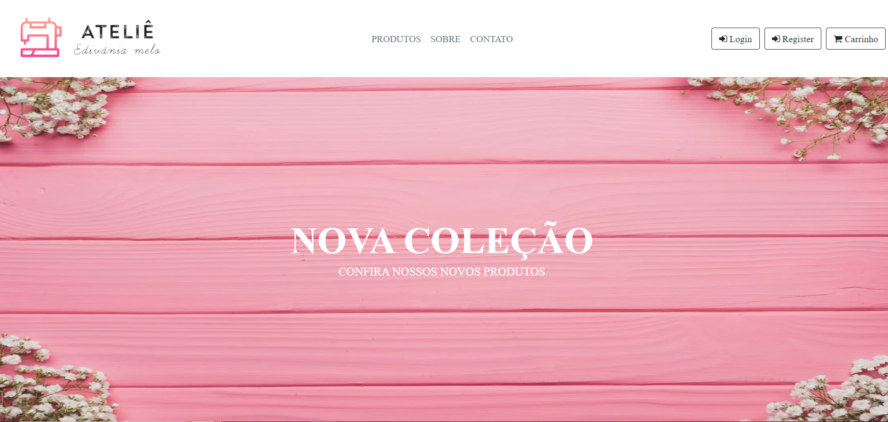

# README

 Esse projeto é um E-commerce 

---
 

<h4 align="center">
 🚧 Em breve um E-commerce Ateliê Edivânia Melo em construção 🚧...
  </h4>

### Features
- [X] Criar Título
- [X] Criar Descrição
- [X] GIF's
- [X] API própria (hospedada no heroku) https://atelieedvania.herokuapp.com/products

### Prévia

 

<h1 align="center">
  
</h1>
